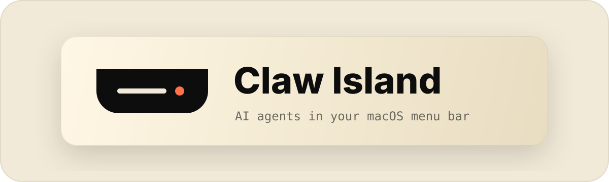

<p align="center">
  
</p>

<h1 align="center">Claw Island for macOS</h1>

<p align="center">
  面向 AI 编程工作流的原生 macOS 悬浮控制台。<br>
  A native, local-first control surface for AI coding agents on macOS.
</p>

<p align="center">
  
  
  
  <a href="LICENSE"></a>
</p>

## Claw Island 是什么？

Claw Island 常驻 Mac 刘海区或屏幕顶部，把多个 AI 编程代理的运行状态集中到一个轻量悬浮面板中。你可以查看会话进度、处理权限请求，并一键回到对应终端或 IDE，不必在多个窗口之间反复切换。

它强调三件事：**本地运行、原生体验、专注开发**。会话与配置保存在本机，不依赖远程服务，也不要求额外账户。

## 核心能力

- 实时查看 Claude Code、Codex、Cursor、Gemini CLI、OpenCode 等代理会话
- 在悬浮面板中处理权限请求和输入提醒
- 一键返回正确的终端、标签页、tmux pane 或 IDE 工作区
- 支持 Terminal.app、Ghostty、iTerm2、WezTerm、Warp、VS Code、Cursor 与 JetBrains IDE
- SwiftUI + AppKit 原生界面，支持 Apple Silicon 与 Intel Mac
- 中英文界面、本地会话恢复、通知声音和自动更新

## 版本与系统

| 项目 | 信息 |
|---|---|
| 项目名称 | **Claw Island for macOS** |
| 当前版本 | **v1.1.7** |
| 支持系统 | **macOS 14.0 或更高版本** |
| 支持架构 | **Apple Silicon / Intel** |
| 技术栈 | **Swift 6.2 · SwiftUI · AppKit** |
| 许可证 | **GPL-3.0** |

## 快速开始

### 从源码运行

```bash
git clone https://github.com/cryptoshatter/claw-island.git
cd claw-island
open Package.swift
```

使用 Xcode 运行应用；首次启动后，可在设置中安装或管理 Codex、Claude Code 等工具的本地 hooks。

> 仓库内部分模块和兼容路径仍保留 `OpenIsland*` 命名，以维持现有配置与升级兼容性。

## 项目来源

Claw Island for macOS 是基于 [Octane0411/open-vibe-island](https://github.com/Octane0411/open-vibe-island) v1.1.7 维护和定制的独立发行版本。原项目贡献者的著作权与提交历史予以保留；本仓库依据 [GPL-3.0](LICENSE) 继续开源。

## License

GNU General Public License v3.0 — see [LICENSE](LICENSE).
